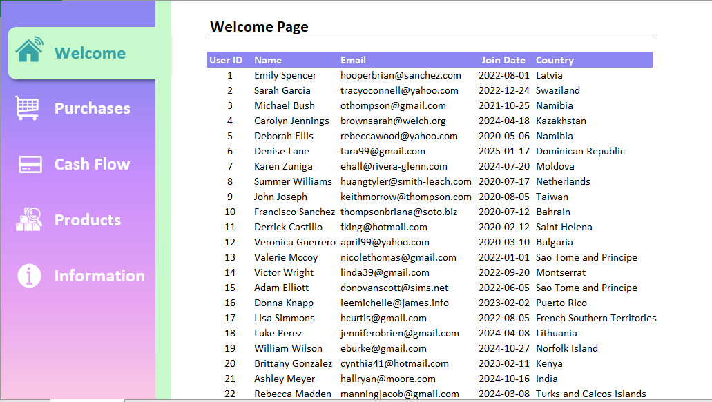

# 🧩 Excel Custom Sidebar Navigation

This project features a fully customized sidebar navigation inside an Excel workbook using VBA and clean UI design. It allows users to switch between key pages like **Welcome**, **Purchases**, **Cash Flow**, **Products**, and **Information** with one click, giving a dashboard-like experience within Excel.

---

## 🔧 Features

- 🎨 Left-hand vertical sidebar with colored navigation buttons
- 🏠 Welcome page with tabular data (User details)
- 🧠 Visual icons for each section (Purchases, Cash Flow, etc.)
- 📁 Modular layout – easy to expand with new sheets
- ⚡ VBA macros used to automate navigation and control visibility
- 💼 Clean and professional UI with a corporate-ready design

---

## 🗂 Files

- `Excel-Custom-Sidebar.xlsm` – Excel workbook with sidebar and VBA code
- `Excel-Custom-Sidebar.png` – Screenshot for preview
- `README.md` – This file

---

## 🛠 Requirements

- Microsoft Excel (2016 or later)
- Enable Macros to use navigation buttons

---

## 📸 Preview

Here's what the sidebar and main page look like:

---

## 💡 How It Works

- **Sidebar Buttons:** Each button is linked to a VBA macro that activates a different worksheet.
- **Icons:** Icons are embedded images or shapes aligned to button text.
- **Welcome Page:** Displays user data in a formatted table (can be dynamically updated).

---

## 📜 License

This project is open-source under the [MIT License](LICENSE).

---

## 🙋‍♂️ Author

Developed by Muhammad Hamza.  
Connect on [LinkedIn](https://www.linkedin.com/in/muhammadhamza9) | View More Projects on [GitHub](https://github.com/hamza-py)
